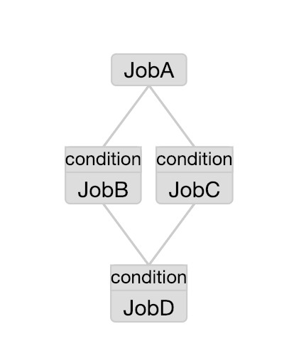
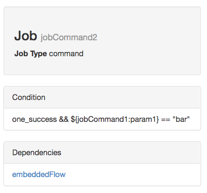
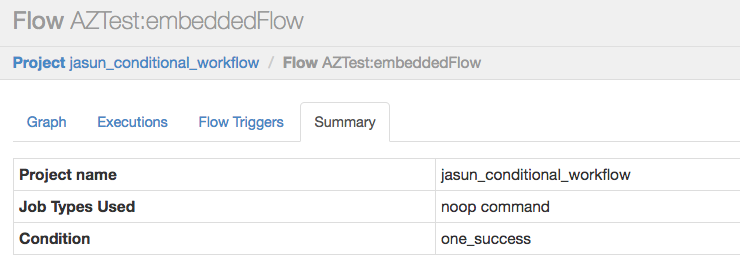

.. _ConditionalFlow:

Conditional Workflow
=============

*****
What is Azkaban Conditional Workflow?
*****

Conditional workflow feature allows users to specify whether to run certain jobs based on conditions.

Users can run or disable certain jobs based on runtime parameters like the output from previous jobs. Azkaban provides users with some predefined macros to specify the condition based on previous jobs' status. With those conditions, users can obtain more flexibility in deciding the job execution logic. For example, they can run the current job as long as one of the parent jobs has succeeded. They can achieve branching logic inside a workflow.

Conditional workflow feature leverages Azkaban Flow 2.0 design ( see :ref:`CreatingFlows` ). The condition is defined inside a flow YAML file.

*****
How to define a condition?
*****
A valid condition is a combination of multiple conditions on job runtime parameters and one condition on job status macro. Comparison and logical operators can be used to connect individual condition components.

Supported operators are:  ``==, !=,  >, >=, <, <=, &&, ||, !``

Condition on job runtime parameter
########
Variable substitution ``${jobName:param}`` can be used to define the condition on the job runtime parameter.
``:`` is used to separate the jobName and the parameter.
The runtime parameter can be compared with a string or a number in the condition.
Users need to write the value of the parameter into the ``$JOB_OUTPUT_PROP_FILE`` ( This output file is available to most Azkaban jobs ).

Condition on job status macro
########
This condition will be evaluated on all the parent jobs, i.e. the ``dependsOn`` section in YAML
file.

**Currently supported macros**:

  - ``all_success`` (default)
  - ``all_done``
  - ``all_failed``
  - ``one_success`` (at least one parent job succeeded)
  - ``one_failed`` (at least one parent job failed)

**Corresponding job status for each macro**:

  - all_done:
    ``FAILED, KILLED, SUCCEEDED, SKIPPED, FAILED_SUCCEEDED, CANCELLED``
  - all_success / one_success:
    ``SUCCEEDED, SKIPPED, FAILED_SUCCEEDED``
  - all_failed / one_failed:
    ``FAILED, KILLED, CANCELLED``

Users are not allowed to combine multiple conditions on job status macros in one single condition because they might have conflict with each other.

Some valid examples
########
::

  ${JobA:param1} == 1 && ${JobB:param2} > 5
  one_success
  all_done && ${JobC:param3} != "foo"
  (!{JobD:param4} || !{JobE:parm5}) && all_success || ${JobF:parm6} == "bar"

Sample conditional flow YAML file
########
sample.flow
::
  nodes:
   - name: JobA
     type: command
     config:
       command: bash ./write_to_props.sh

   - name: JobB
     type: command
     dependsOn:
       - JobA
     config:
       command: echo “This is JobB.”
     condition: ${JobA:param1} == 1

   - name: JobC
     type: command
     dependsOn:
       - JobA
     config:
       command: echo “This is JobC.”
     condition: ${JobA:param1} == 2

   - name: JobD
     type: command
     dependsOn:
       - JobB
       - JobC
     config:
       command: pwd
     condition: one_success

write_to_props.sh
::
  echo '{"param1":"1"}' > $JOB_OUTPUT_PROP_FILE

In this sample conditional workflow, JobA first writes the value of param1 into ``$JOB_OUTPUT_PROP_FILE``. Then JobB and JobC evaluate their own conditions and see if JobA's
param1 equals to their expected value. Here JobB's condition satisfies but JobC's condition fails. So JobB will start to run but JobC will be canceled. Once JobB finishes, JobD will start to evaluate its condition which says one_success, meaning as long as either JobB or JobC succeeds, it will start to run.

You can define the condition for both jobs and subflows.

*****
View condition from Azkaban web UI
*****
A job or embedded flow with condition will show up with a condition tag from the flow graph page.

You can view the job condition on the job page:

Also, you can view the condition of an embedded flow in the flow summary page:

*****
Download Examples
*****
You can download the simple conditional workflow project zip example to try out this feature:

* `conditionalFlowProject.zip <https://github.com/azkaban/azkaban/blob/master/az-examples/conditional-flow/conditionalFlowProject.zip>`_

