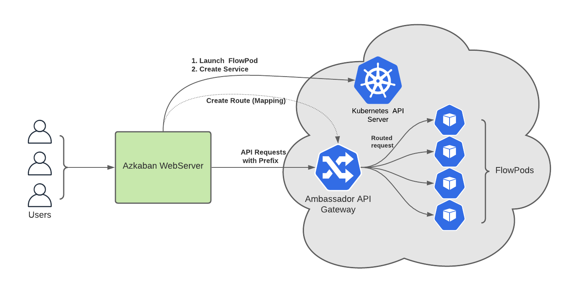

.. _ContainerReverseProxy:

Flow API Access for Containerized Executions
============================================

**Author**
`Shardool <https://github.com/orgs/azkaban/people/sshardool>`_ ,

**Contributors:**
`Arvind Pruthi <https://github.com/orgs/azkaban/people/arvindpruthi>`_ ,
`Janki Akhani <https://github.com/orgs/azkaban/people/jakhani>`_ ,
`Deepak Jaiswal <https://github.com/orgs/azkaban/people/djaiswal83>`_ ,
`Aditya Sharma <https://github.com/orgs/azkaban/people/aditya1105>`_  ,
`Abhishek Nath <https://github.com/orgs/azkaban/people/abhisheknath2011>`_

.. contents:: Table of Contents
  :local:
  :depth: 2

Flow APIs in Bare-Metal Architecture
************************************

* Bare-metal Executor Servers expose multiple APIs, several of which are not required for
  Containerized Executions. However, there are some important APIs which still need to be supported.
* In particular the APIs for Flow Management and Log Management are heavily used (through the
  WebServer).

Containerized Flow Executions
*****************************

* Azkaban utilizes a **Disposable Container** model, i.e for every flow execution a fresh Pod is
  launched for orchestration of the flow. Pod is destroyed once the flow execution completes. We
  refer to this per-flow Pod as the **FlowPod**.
* By default every Kubernetes Pod (and thereby FlowPods) get a unique IP address that is internal to
  the Kubernetes cluster and cannot be used to connect to the Pod directly from outside of the
  Kubernetes internal subnet.
* With the Azkaban Webserver being hosted outside of the Kubernetes cluster an alternative mechanism
  is needed to allow the Webserver to communicate with FlowPods.

Kubernetes Ingress and API Gateways
***********************************

* Kubernetes provides an Ingress mechanism which which allows HTTP and HTTPS routing from
  outside the Kubernetes cluster to services within the cluster. An **Ingress Controller** in
  Kubernetes is responsible for satisfying an **Ingress** request, which essentially creates a
  route to a service internal to the cluster.
* An alternative to Kubernetes provided Ingress support is an **API Gateway**. API Gateways can
  fulfill Kubernetes specified Ingress needs and along with that provide a rich set of features
  which are beyond what Kubernetes Ingress requires.
* One such open source API Gateway is Ambassador. It's based on the Envoy proxy and provides a
  rich set of features that satisfy current requirements for Containerized Executions and will
  likely be extensible for future Azkaban needs as well.
  <todo ambassador and envoy links>
* The Disposable Container model of Containerized Executions requires new routing rules to be
  setup and destroyed for every flow execution. This kind of dynamic routing is well supported by
  Ambassador, making it suitable for the Containerized Execution use-case.

Flow API - Design
*****************

1. When the Azkaban WebServer creates the FlowPod for an execution it is also going to create
   additional resources.

   * A Kubernetes service which will expose the FlowPod internally within the cluster.
   * An Ambassador Mapping that can route HTTPS requests from outside the cluster to the
     Kubernetes service created for the FlowPod.

#. The Ambassador Mapping created per-flow will specify routing based on a 'prefix' replacement
   rule. The prefix in this case will be a combination of the Azkaban cluster name along with the
   flow execution-id, which is unique for every flow execution.

   * For example for cluster-name `cluster1` and execution-id `12554` the API endpoint for
     API calls will look like:

.. code-block:: prefix-example
   https://kubernetes-api-server:<ambassador-port>/cluster1-12554/container

#. FlowPod will be updated to listen for API requests on a fixed port, the port will be specific
   to the unique IP Address and the corresponding Kubernetes service for the Pod.

#. Azkaban WebSserver will be updated such that for all API requests that need to reach a FlowPod
   the URL will be generated correctly to account for the reverse proxy and the prefix based
   routing rule.

#. Azkaban WebServer will determine whether a prefix-based URL will be generated on per-execution
   basis as a single Azkaban cluster can have a combination of bare-metal executors as well as
   Containerized Executions.

Service and Mapping Details
***************************

* While Ambassador allows explicit creation of Mapping resources which can establish a
  prefix-based route to a Kubernetes service, we have instead opted for a different alternative
  where the mapping (routing) information can be specified as annotations associated with the
  Kubernetes service itself.
* This works well for our use-case as there as an exact one-to-one correspondence between
  FlowPods and the corresponding Kubernetes service.
* The intended lifecycle of the Kubernetes service for a FlowPod is also designed to be closely
  associated with the lifecycle of the FlowPod itself. By using service annotations for providing
  the mapping we associate the lifecycle of the mapping (routing rule) with the service and
  therefore with the FlowPod.

.. code-block:: annotation-example
  apiVersion: v1
  kind: Service
  metadata:
    annotations:
      getambassador.io/config: |
        ---
        apiVersion: ambassador/v2
        kind:  Mapping
        name: fc-mapping-cluster1-12554
        prefix: /cluster1-12554/
        service: fc-svc-cluster1-12554:54343
        rewrite: /
    name: fc-svc-cluster1-12554
    namespace: cop-dev
  spec:
    ports:
    - name: flowport
      port: 54343
      protocol: TCP
      targetPort: 54343
    selector:
      service: flow-cluster1-12554
    type: ClusterIP

* The example above creates an annotation based mapping associated with the service. The service
  will be exposed to http requests with the prefix *cluster1-12554*. Ambassador will internally
  take care of removing this prefix before forwarding any request to the ClusterIP service. This
  replacement is specified in the *rewrite* section of the annotation.
* Also note that we are creating a service of type *ClusterIP* for the FlowPods. This makes the
  service available only within the Kubernetes cluster but is the preferred alternative compared
  to a *NodePort* service (which reserve a Kubernetes cluster-wide port and are not recommended for
  use with such dynamic service creations)

Alternatives to Current Reverse Proxy Design
********************************************

1. **FlowPods Invoke WebServer APIs** -
   At the high level this would require the following.

   * Introduce a set of APIs on WebServer which will be executed periodically by all FlowPods.
   * Example, API for Updating the current flow and job logs, API for polling for flow execution
     cancellation requests.
   * Needs the WebServer to the accessible from FlowPods, but for most Kubernetes setup this should
     only require updating the network firewall rules.

   Reasons for not choosing this alternative.

   * Doesn't scale well for a large number of concurrent executions and the load on WebServer will
     increase significantly.
   * Requires unnecessary information exchange. For example, all the flow and job logs would be
     communicated to the WebServer whereas users/clients would typically be requesting only a small
     fraction of those at any given time.
   * Polling intervals can be tricky to configure.
   * Future extensibility is compromised. For any new functionality requiring an API on FlowPod,
     We would have to work backwards and provide an API on the WebServer for invocation by FlowPods.

#. **Roll-out our own Reverse Proxy** -
   The feature set of such a reverse proxy could be quite small and tailored to Azkaban's needs.
   We decided against this.

   * It's not very straightforward to create and maintain a scalable, high-performance proxy
     service. Multiple well tested and popular alternatives are already available.
   * Using a feature-rich off shelf solution (like Ambassador) should help with future Azkaban
     needs, in case a more complex requirements show up.

References
**********

1. Ambassador API Gateway Documentation -
   https://www.getambassador.io/docs/edge-stack/latest/topics/concepts/

#. Prefix Based Routing - https://www.getambassador.io/docs/edge-stack/latest/topics/using/rewrites/

