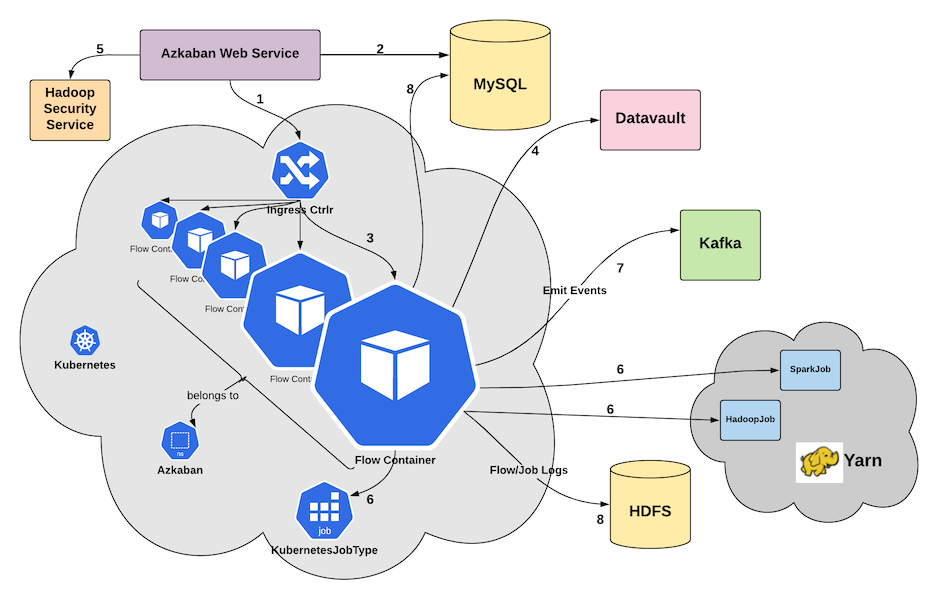
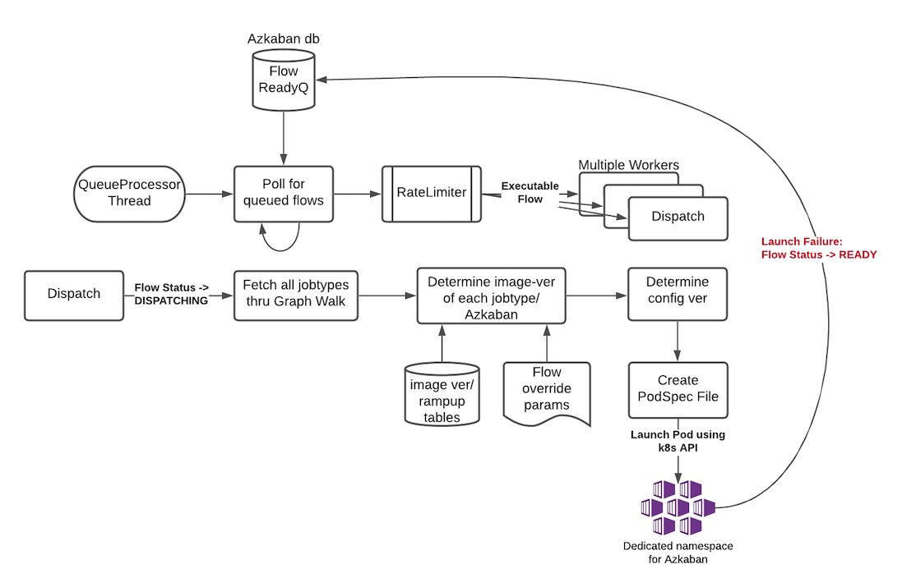
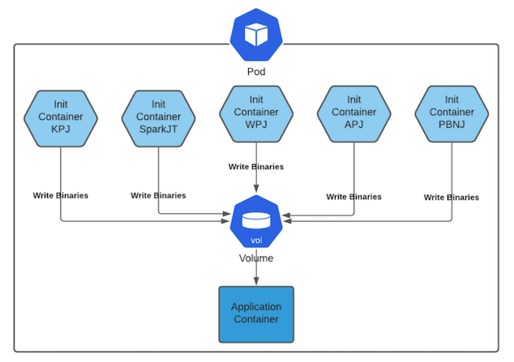

Azkaban Containerized Executions - Design Doc
=============================================

**Authors/Key-Contributors:**
`Arvind Pruthi <https://github.com/orgs/azkaban/people/arvindpruthi>`_ ,
`Janki Akhani <https://github.com/orgs/azkaban/people/jakhani>`_ ,
`Shardool <https://github.com/orgs/azkaban/people/sshardool>`_ ,
`Deepak Jaiswal <https://github.com/orgs/azkaban/people/djaiswal83>`_ ,
`Aditya Sharma <https://github.com/orgs/azkaban/people/aditya1105>`_  ,
`Abhishek Nath <https://github.com/orgs/azkaban/people/abhisheknath2011>`_

.. contents:: Table of Contents
  :local:
  :depth: 2

Background/Overview of Bare-Metal Architecture
**********************************************

.. image:: figures/azkaban-architecture.png

* Each Azkaban Cluster is made of a single web server, one or more “bare metal” executor servers and a mysql db to
  track history and state.
* Each bare metal server is capable of orchestrating a few 10s of flows simultaneously depending on the resource
  requirements of each flow.
* The executor server polls flows that are ready to run on a frequent basis from MySQL based queue (“dispatch
  logic”) (Typical config: 1/s).

Azkaban Executor Server Responsibilities
----------------------------------------

Dispatch
^^^^^^^^
* Executor Server polls the db based queue for flows frequently (typically 1/s) contingent on resource availability.
* Sets up the flow (Parses all properties, de-serializes the workflow to build an in-memory graph, downloads binaries
  in Project Cache if missing, allocates resources: thread pool, execution directory etc.) and finally:
* Kicks off the orchestration of the flow.

Orchestration
^^^^^^^^^^^^^
* Executor Server manages a thread pool per flow, which allows multiple jobs to run in parallel.
* Hadoop tokens are fetched from the Hadoop name node to allow launching of a YARN application.
* Each job is launched in it’s own separate process with the flow admin account.
* During the orchestration process, the Executor server manages the state machine of the flow, keeps the database up
  to date with flow/job state and finally flushes flow logs to the database.

Flow Management
^^^^^^^^^^^^^^^
* Executor server is an end-point for AJAX APIs to respond to requests such as Pause, Kill, Resume etc. Flows are
  killed when they reach the SLA limit of 10 days.

Log Management
^^^^^^^^^^^^^^
* Executor server’s AJAX API endpoint supports streaming logs for live flows/jobs. When a flow/job finishes, the
  completed logs are pushed to the Azkaban db in 15MB chunks (Configurable).

Deployment
^^^^^^^^^^
* During deployment, new binaries are updated on the bare-metal server and some tests are performed to verify the
  sanity of the machine.
* If tests pass, the Executor Server is put in inactive mode, upon which it stops polling for flows except for
  those pinned to that particular executor.
* A new Executor Server is launched with new binaries and is marked as active; thereby, resuming normal function.

Issues with Bare Metal Executor Server Model
--------------------------------------------

Noisy-neighbor Issues (No resource Isolation)
^^^^^^^^^^^^^^^^^^^^^^^^^^^^^^^^^^^^^^^^^^^^^
Azkaban’s Job Type model allows users to inject arbitrary code on the executor. It is easy to write a job
that consumes an unfair share of resources (Compute, Memory or Storage) which may overwhelm the executor server;
thereby causing noisy-neighbor issues.

Scaling/Maintenance Issues (Inflexible Infrastructure)
^^^^^^^^^^^^^^^^^^^^^^^^^^^^^^^^^^^^^^^^^^^^^^^^^^^^^^
Scaling is a step function requiring servers to be provisioned by SREs. This is rooted in a decade old
architecture. The bare-metal architecture does not benefit from the advanacements made in flexible
provisioning, found commonplace in cloud.

No Canary for Azkaban binaries or the jobtypes
^^^^^^^^^^^^^^^^^^^^^^^^^^^^^^^^^^^^^^^^^^^^^^
Azkaban executors are the gateway to critical compute infrastructure. It brings together layers of platform
binaries such as for Hadoop, security manager, spark etc besides Azkaban’s own binaries, configurations,
jobtypes. Currently, there is no canary in place for a fine-grained tune-up. Experience within Linkedin shows
how painful it can be to roll out major upgrades without a proper canary system.

Mismatched Queueing from YARN
^^^^^^^^^^^^^^^^^^^^^^^^^^^^^
Azkaban implements it’s own queueing to maximize the use of bare-metal Executors. This queueing is often
mismatched from YARN queues causing issues downstream.

Deployment Issues
^^^^^^^^^^^^^^^^^
As part of deployment, the inactive ExecutorServer process may continue for up to 10 days to satisfy Azkaban’s
SLAs, occupying a lot of memory and CPU. Hence, if a deployment has issues, successive attempts to rectify the
problem leave additional beefy ExecutorProcesses running, causing memory sap leading to GC pauses and OOMs.
They also pollute metrics.

Key Requirements for Containerization
*************************************

1. Azkaban Web Server should be able to Launch flows in independent containers, thereby giving a fully isolated
   environment for each flow.
#. Be able to respond quickly in response to Spikes in demand (Flexible Infrastructure).
#. Provide a way for components that make up Azkaban to evolve independently of each other.

   * Give the evolution control for Platform, Azkaban and Jobtypes to their corresponding owners.
   * Provide users a way to override default binary versions of Azkaban/jobtypes etc. to the version of their choice
     (Helpful during development process of infrastructure -- Azkaban/jobtypes/platform).

#. Provide plumbing for a fine-grained Canary system that can allow Azkaban/jobtypes and platform full
   control of ramping up their binaries, independent of each other.

Future Extensions
-----------------
1. Provide the fine-grained Canary system for Multiple components that make up Azkaban to help in their
   independent evolution.

High Level Design Summary
*************************

1. Azkaban will follow a **Disposable Container** model. This implies that whenever a flow is to be launched, the
   **dispatch logic** will launch a fresh Pod and the pod is destroyed at the conclusion of the flow.
#. Isolation is achieved per flow (Not at job level). Jobs/subflows that are a part of a flow, will run within the
   confines of the pod launched for orchestrating the flow. Job level isolation was explored and rejected:

   * It is very disruptive given the existing Azkaban architecture. Major portions of executor code will have to be
     re-written to accommodate job level isolation.
   * It appears too resource hungry to launch a separate pod per job. Separate container within the same pod is
     possible. But again, this would have required rewriting major parts of flow - job wiring. This is something
     that can be reconsidered in future.

#. The pod will be launched with default compute/memory resources, but override parameters will be available to
   request more resources for the flow orchestration.
#. For this design iteration, the web server will stay outside of k8s. This does not preclude the need for the
   web server to talk to flow pods to fetch logs or send control commands (Such as Cancel). To enable this
   communication, an Envoy Proxy based Ingress Controller is introduced, which will allow the web server to
   communicate with Flow Pods. There is no need to directly expose flow pods outside of the Kubernetes cluster.
#. In order to satisfy `key Requirement #3 <#Key-Requirements-for-Containerization>`_, the execution environment
   for flow pods will be constructed dynamically at run-time.

   * Azkaban will provide a mechanism to dynamically select versions of components that constitute a functional
     Azkaban Executor environment at dispatch time.
   * Following this, a series of init containers will pull intended versions of various components to compose the
     complete execution environment.
   * The dynamic selection process will be utilized to provide canary capability for various Azkaban components.
   * The design also introduces a few Admin APIs to make the task of image management easier.

Design Details
**************

Image Management
----------------
* Azkaban will rely on docker images to create execution environment for flows. In order to satisfy
  `key Requirement #3 <#Key-Requirements-for-Containerization>`_, the final pod will be constructed
  dynamically using init-containers [1]_ when the flow pod is launched. The required layers will be
  discovered as laid out in the `dispatch logic <#Dispatch-Logic>`_.
* Azkaban execution environment is composed of the following types of dependencies:

+-----------------------+--------------------------------------------------------------------------+
|    Dependency Type    |                          Description                                     |
+=======================+==========================================================================+
| Platform Dependencies | Binaries/Configs/Secrets for Hadoop, Hive, Spark, Pig, Dali, Ksudo, etc. |
+-----------------------+--------------------------------------------------------------------------+
| Azkaban Core          | Core Azkaban binaries/configs/secrets owned and managed by Azkaban       |
+-----------------------+--------------------------------------------------------------------------+
| Azkaban JobTypes      | Binaries/Configs owned by JobType developers but are managed by Azkaban  |
|                       | like KafkaPushJob, SparkJob, etc.                                        |
+-----------------------+--------------------------------------------------------------------------+

* Azkaban Core forms the base docker image layered on top of a base image of choice: such as RHEL7.
* Each of the above (Platform or jobtypes) will be packaged as a separate docker image layers on top of a simple
  base image of choice. It is preferable to keep these images very small to optimize download times. Something
  like a busybox/alpine image should suffice.
* Individual images for job-types will allow independent development and release for the job-type developers without
  any dependency on Azkaban. Here is an example image definition for KPJ (Kafka Push Job):

.. code-block:: docker

  FROM container-image-registry.mycorp.com/rhel7-base-image/rhel7-base-image:0.16.9

  ARG KPJ_URL=https://artifactory.mycorp.com/kafka-push-job/kafka-push-job/0.2.61/kafka-push-job-0.2.61.jar

  RUN curl $KPJ_URL --output ~/kafka-push-job-0.2.61.jar

* There will be one init container [1]_ for each job-type using job-type docker images. This init container will move
  the binaries and configs from the image to a mounted volume. The above specified volume will also be mounted for the
  application container which will use Azkaban docker image.
* Job-Type developers will use `Image Management APIs <#Image-Management-API>`_ for rolling out a job-type image.
  The rolled out images, can then be used as a default version for that job-type. Flow writers will have the ability
  to specify the version for the job-type image they want to use for their Azkaban flows via DSL.
* A concept of version-set and version-number is introduced to uniquely identify the state of the dependencies
  during the flow execution. This will also be useful during debugging the recreate exact environment for a flow
  should there be any failures.

Image Management API
--------------------
In order for the various image owners to give them their independent development life-cycle, we introduce various
Admin API to:
* Register image types along with their owners
* Register new versions of already registered image types
* Create/Update ramp-up plans for registered image versions

For details regarding these API, please refer to :doc:`imageMgmtAPI.rst`

Dispatch Logic
--------------

1. Whenever a flow is ready to run (By schedule, by data triggers or manually through UI/API call),
   the AZ Web Server will mark the flow with the state: ``READY`` and insert the flow in the queue
   (**execution_flows** table).

2. The **QueueProcessor** class will pick up executions based on priority and submit_time and set the state as
   ``DISPATCHING`` for the picked flows. A rate-limiter is introduced here so the Kubernetes namespace does not
   get overwhelmed with the rate of creating containers. Finally, each of the picked flows are then submitted for
   **dispatch**. The dispatch logic:

   * Will require a pre-configured Kubeconfig file to organize the information about clusters, users, namespaces
     and authentication mechanism. Kubeconfig file for Azkaban-web-server will contain the path for the certificate
     which will be used to authenticate with Kubernetes. Azkaban web server needs permission to create pods in a
     namespace dedicated for containerization on each Kubernetes cluster.

   * A graph walk on the flow is performed to determine which jobtypes are needed for the execution environment.
     **image_ramp_up** and the **image_versions** tables are used to identify which image versions should be
     used for Azkaban, platform and the corresponding job types.

   * The needed versions Config are put together in alphabetical order in a JSON file and it constitutes the
     **Version-Set** that is used to create the execution environment. The Version Set constitutes all details
     required to reconstruct the execution environment if a repeat execution is required. If the version set
     is not already existing in tables, is added to **version_set** table.

   * The version_set is a very useful concept. With the proposed changes, Azkaban will become a very dynamic
     environment where the list of binaries used to launch a flow will become very dynamic (Some combination of
     Platform binaries, Azkaban binaries or job type binaries are always ramping up). In such an environment,
     in order to debug flows it may become important to reproduce the same set of binaries, which were used to
     launch the flow. The version_set number provides a single version string that represents the list of
     binaries with their corresponding version numbers to launch the flow. Hence, reproducible!

   * Finally, a YAML file is constructed on the fly for all parameters necessary to create the execution
     environment for the pod. This YAML is then used to launch the Pod in the kubernetes namespace.

Kubernetes Secrets
------------------
Kubernetes secrets will be used to package any credentials such as passwords, certificates
etc. that are required for internal services used by Flow Containers.

Init Containers
---------------
Init containers [1]_ is a Kubernetes concept. The role of init containers is to put together everything necessary
to launch a fully functional flow container.

1. Kubernetes will run the init containers in a sequence before the control is given to the application container
   as shown in the picture.

#. Each Jobtype that is included in the flow will correspond to an init container that gets
   initiated. This init conatainer will take the layer for the jobtype binary and add it to the volume
   for the application container.

Flow Container
--------------

1. A new class: "FlowContainer" will be created by refactoring code from the FlowRunnerManager. The purpose of this
   class is to provide the anchor that initiates the flow orchestration as well as respond to control/health check
   commands.

#. The FlowContainer class is a simplified version of FlowRunnerManager with certain assumptions:

   * This class will handle a single flow. Hence, the threading model can be simplified.
   * There is no need to host polling logic as k8s based dispatch is done on the web server.
   * There is no need to clean up execution directory or cache as the pod will be destroyed after the flow finishes.
   * The above mentioned simplifications will have the effect of reducing the tech debt in flow orchestration.

#. The web server needs to talk to the Kubernetes pods as the executor server hosts an AJAX API
   endpoint for various control operations such as Cancel, Pause, Resume, FetchLogs etc. For the web server
   to continue using this API endpoint, we need to enable communication between the Webserver (Which is outside
   the k8s cluster) and the flow container pods. For this reason, we plan to use the
   Ambassador Ingress Controller [2]_ between the Web Server and the Flow Container Pods.
   More regarding the ingress controller `here <#ingress-controller>`_

#. In the long-run, we do plan to bring in web server into Kubernetes as well, thereby eliminating the
   Ingress Controller. For the short-term, we will continue to live with the added complexity.

#. At Linkedin our internal analysis shows that APIs beyond Cancel, FetchLogs and Ping are rarely used. For
   the sake of simplicity, for now FlowContainer endpoint will not support other AJAX APIs that are
   supported on non-containerized version.

#. During flow execution, flow and job life cycle events may need to be sent to Kafka through the
   Event Reporter plugins as well as job/flow status updates may need to be made in Mysql db.
   For sending events to Kafka, azkaban-exec-server’s cert issued by a valid certificate authority will be used
   to authenticate flow containers. This and MySQL credentials will be pulled from Kubernetes secret.

Ingress Controller
------------------

1. As mentioned in the [Flow Container Section](#flow-container), we will be utilizing the
   Ambassador Ingress Controller [2]_ as a reverse proxy.

#. The ingress controller will provide necessary routing between web server and the flow pods running on
   kubernetes infrastructure. A key aspect of this architecture is that the routes between web server and flow pods
   need to be updated dynamically at flow dispatch time and right after a flow finishes.

#. The Ambassador Ingress Controller essentially provides a dynamically configurable reverse proxy that
   allows routing of request from the web server to the correct flow pod. This is realized
   through annotations [3]_.

Logging in Executor
-------------------
1. The AJAX API endpoint (FetchLog) will continue to be the means for the Azkaban UI to pull logs for the
   flows/jobs in progress.

#. For maintaining log access after flows finishes, the logs are split in chunks and copied to the Mysql db.
   This has known to be an anti-pattern that we intend to address. Instead, we plan to copy logs to
   a configurable directory path in HDFS. However, the scope of this is outside the containerization
   track. Also this will be beneficial to containerized as well as non-containerized Azkaban.

How does the proposal solve Issues with Bare Metal Model?
*********************************************************
1. Full Resource Isolation - 1 DAG per container.

#. Operationally, the containerized version is much better because:

   * Faster deployments (Deployment is just about calling APIs to register new image versions and setting up
     ramp-up plans.
   * No re-starts required in response to config changes; new flows automatically pick up updates.
   * Ability to scale up/down linearly (Not a step function) and instantly based on demand.
   * No need to maintain/monitor health of specific machines.
   * Deployments will not impact running flows any more.

#. Image/Jobtype owners to get freed from dependency on Azkaban for deployments. They can ramp-up/ramp-down their
   binaries completely independent of Azkaban's deployment cycle.

**Bonus benefits...**

1. A lot of Executor Server related tech-debt disappears: in-memory state in executor servers, onsite overhead in
   managing server health, executor deployment issues etc.
#. Deployment of ExecutorServer becomes straightforward: Push new docker image to the image-registry and call the API
   to register the new image and a subsequent ramp-up.
#. Deployment takes more than a week on bare metal, it could be much less with containerization as executor servers
   take most of the time in deployment.
#. Flow executions can be made resumable-on-crash.

Open Items
**********
1. Over-ride param for flows to specify a particular image version
2. Over-ride param for version set
3. Over-ride param for requesting CPU/Mem resources for flow containers
4. Thoughts on debugging etc.
5. Mechanism for configs

References
==========
.. [1] About Init Containers - https://kubernetes.io/docs/concepts/workloads/pods/init-containers/
.. [2] Ambassador Ingress Controller - https://www.getambassador.io/docs/latest/topics/running/ingress-controller/
.. [3] Annotations - https://kubernetes.io/docs/concepts/overview/working-with-objects/annotations/
