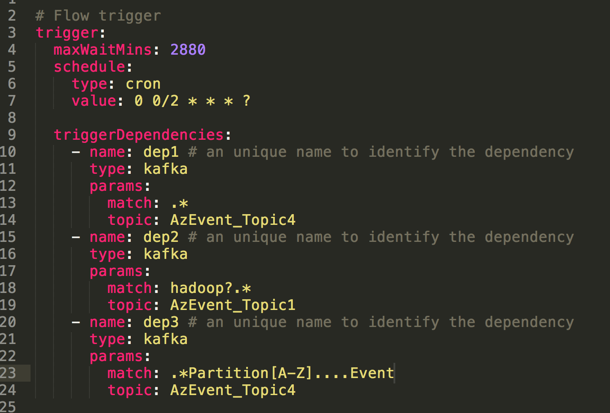
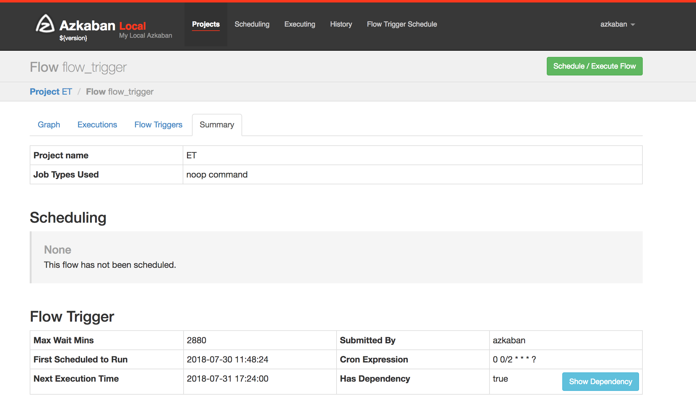
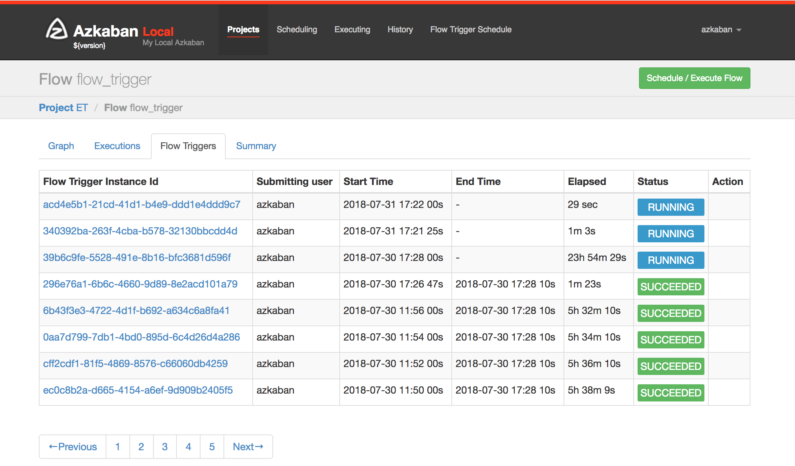
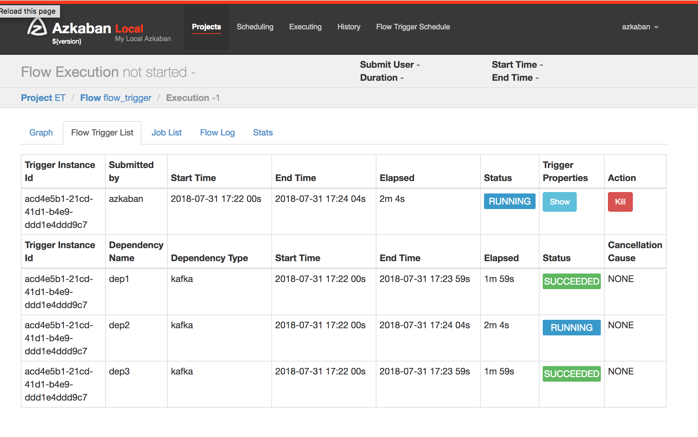
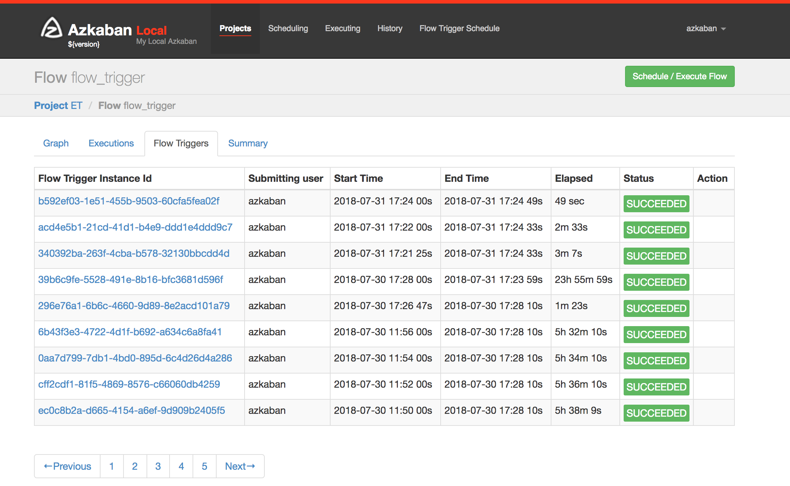

.. _EventBasedTrigger:

Flow Trigger Dependency Plugin
==================================
*****
Kafka Event Based trigger
*****

..
   Todo:: Link to the data trigger documentation if available

Currently, Azkaban supports launching flows via scheduling it or Ajax API. However, they are limited because sometimes jobs need to be executed automatically on demand. Event trigger is a new feature introduced by Azkaban. It defines a new paradigm of triggering flows - triggering a flow on Kafka event arrival. This concept enables users to define events that the flow depends on. Once all of the events become ready, a workflow will be triggered.

Apache Kafka is a Publish & Subscribe data streaming system. By utilizing Kafka, we do the regular expression match on the Kafka event payload. With the contain-a logic matching, a dependency will be marked as satisfied only if the whole payload contains the Regex pattern that user predefines.

*****
Getting Started with Deploying Event Trigger on the Azkaban
*****

Azkaban builds use Gradle (downloads automatically when run using gradlew which is the Gradle wrapper) and requires Java 8 or higher.

Build
########
The following commands run on *nix platforms like Linux, OS X. For building Flow Trigger Dependency Plugin, we need to run the comment in ``/az-flow-trigger-dependency-type/kafka-event-trigger`` directory. 
::
  # Build Azkaban
  ../../gradlew build

  # Clean the build
  ../../gradlew clean

  # Build without running tests
  ../../gradlew build -x test

These are all standard Gradle commands. Please look at the Gradle documentation for more info.

Server Configuration
########
The gradlew commands help you to build the fat JAR. After that, you need to specify the plugin.dir within ``conf``. Take solo-server for example, override the ``azkaban.dependency.plugin.dir`` property for runtime parameters inside the ``azkaban.properties`` file under the solo-server ``conf`` directory.
This property needs to set to contain the location where you put your Event-Trigger JAR file. 

Database Configuration
########
The following 4 properties have to be defined in ``conf/azkaban.private.properties``. for solo-server based on the use case. 

+-----------------------------------------+
| Properties                              |
+=========================================+
| mysql.user                              |
+-----------------------------------------+
| mysql.password                          |     
+-----------------------------------------+
| org.quartz.dataSource.quartzDS.user     |
+-----------------------------------------+
| org.quartz.dataSource.quartzDS.password |
+-----------------------------------------+

*****
Event Based Trigger Plugin Configuration
*****

Inside the Azkaban dependency plugin directory, there should be two items Event Based Trigger plugin jar and the ``dependency.properties``. 

Required properties are:

- **dependency.classpath** - Used by Azkaban identify plugins classpath. Should be the JAR file’s absolute path.

- **dependency.class** - Used by Azkaban flow trigger instance to integrate with this configuration file. Take Event trigger for example, it should be  ``trigger.kafka.KafkaDependencyCheck``. 

- **kafka.broker.url** - Specifying URL and port number where your Kafka broker is. 

*****
Event Trigger Instance Configuration
*****
Event trigger is part of flow definition and each flow can only have one event trigger at most. 
Defining an event trigger is supported via Hadoop DSL.
The trigger needs to be configured within the flow file along with the project zip that users upload.
Event trigger is composed of a list of event dependencies, max wait time and schedule.
Take the following figure as an example:

- **Max Wait Time**: How long the trigger will wait for all dependencies to be available before canceling it.
- **Trigger.schedule**: The schedule to perform this workflow on the regular basis. We use the cron time format here to specify, creating a trigger followed by the project workflow every 2 minutes 

- **triggerDependencies**: The params here are to clarify what regex pattern happening in the event coming from a specific topic channel. The trigger kick-starts the flow if all of the predefined dependency conditions are met. 

Therefore, this trigger example will launch the flow once detecting Kafka event with anything in ``AzEvent_Topic4``, ``.*Partition[A-Z]....Event`` string in event coming from ``AzEvent_Topic4`` and ``hadoop?.*`` in ``AzEvent_Topic1``.

The matching mechanism can be extended other than regex since now it is implemented as a generic interface.

*****
Event Based Trigger Example with Azkaban UI
*****
All scheduled data trigger will show up Azkaban Flow Trigger section. Also, project admins are able to pause and resume a scheduled trigger for an undesirable situation.

**Trigger info page for a specific flow:**

**Current and historic triggers for a specific flow:**

Follow these steps to run end to end local test:

1.Start Kafka Broker Locally:

Following `Kafka QuickStart <https://kafka.apache.org/quickstart/>`_ to run these Kafka console scripts in Kafka package
::
  *Start ZooKeeper
  bin/zookeeper-server-start.sh config/zookeeper.properties
  *Start Kafka Server
  bin/kafka-server-start.sh config/server.properties

2. Send Json event to topics with AzEvent_Topic4 as example:
::
  bin/kafka-console-producer.sh --broker-list localhost:9092 --topic AzEvent_Topic4 < recordPartition.json
Here is how my ``recordPartition.json`` looks like:

.. code-block:: json

    {
        "name":"Charlie", 
        "team": "Azkaban",
        "event":"MetastorePartitionAuditEvent"
    }

Once this event arrived, Azkaban will mark this specific event dependency as success. 

3. Send another event from producer to launch the flow:
::
  bin/kafka-console-producer.sh --broker-list localhost:9092 --topic AzEvent_Topic4 < recordHadoop.json

**Trigger the workflows that have all dependencies cleared out:**

*****
Limitation
*****
Since our design purpose is to decouple the trigger condition from the action to take, currently there is a limitation on deserializing record. Although Kafka provides the ability to publish and subscribe to streams of records on custom serializer and deserializer. What we have right now is limited to Kafka build in String deserializer only. We are planning to enhance the flexibility on users to upload JAR with their own custom deserialize function in the near future. 

