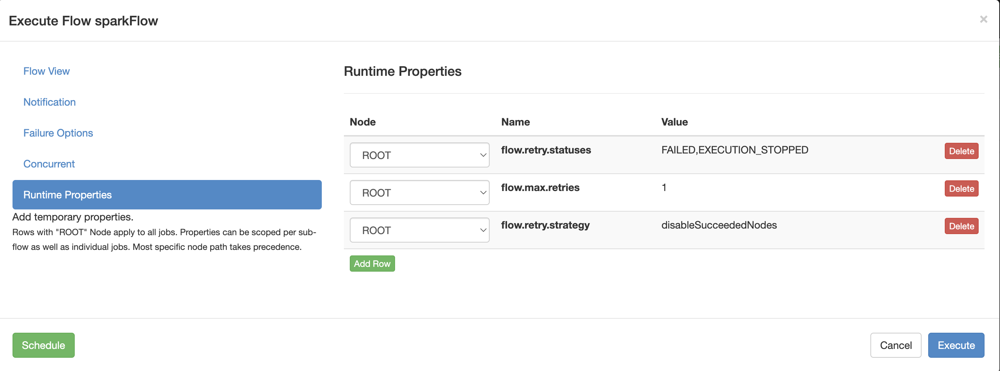

.. _flow-level-retry:

Flow Level Retry
================

**Authors**:
`Zhi Zeng <https://github.com/tsangz2013>`_

Ref: :ref:`ContainerizationDesignDoc`

.. contents:: Table of Contents
  :local:
  :depth: 1

Background
----------
As Azkaban moves into containerization, executions are observing some k8s pod related / infra
related issues that result in the whole execution falls. Plus, many of the flows takes hours to
days to run, and if not attended, a failure may takes hours before the user restart it.

So we build the feature that allows users to enable auto-retry on flow-level,
as well as opt-in-able strategies how to restart the execution.

Currently the retried execution will be of a new / different execution ID than the original execution.

Use cases
---------
- Let the execution to have auto-restart on flow level upon failures, lifting human operation and delay.
- Let the execution to auto-restarted when encountering containerization failures or other infra issues.
- Let the retried execution to skip some nodes that succeeded (correspondingly in the original execution) to save time & resources.

Flow-level retry Parameters
---------------------------
These set of parameters defines the retry behavior of flow / execution.

+-------------------------+----------------------------------------------------+----------------------------+----------------------------------------------------------------------------------------------------------------------------------------------------+
| Flow Param              | Value Type / Note                                  | Example                    | Usage                                                                                                                                              |
+=========================+====================================================+============================+====================================================================================================================================================+
| ``flow.retry.statuses`` | ``String``; Comma delimited list of flow statuses. | FAILED,EXECUTION_STOPPED   | Enable flow-level retry: restart the execution when it falls into the defined statues                                                              |
+-------------------------+----------------------------------------------------+----------------------------+----------------------------------------------------------------------------------------------------------------------------------------------------+
| ``flow.max.retries``    | ``Integer``                                        | 2                          | Define the maximum number of flow-level retries that will be attempted, for the execution(s) falls into the defined statuses.                      |
+-------------------------+----------------------------------------------------+----------------------------+----------------------------------------------------------------------------------------------------------------------------------------------------+
| ``flow.retry.strategy`` | ``String``                                         | retryAsNew (default value) | Define how will an execution be retried when falls into the defined statuses. Currently support strategies: "retryAsNew" & "disableSucceededNodes" |
+-------------------------+----------------------------------------------------+----------------------------+----------------------------------------------------------------------------------------------------------------------------------------------------+

Examples
--------
Users can set the flow-parameters config in web UI directly when submit / schedule executions like:

In this example:

- the execution will be retried if it falls to FAIL or EXECUTION_STOPPED status;
- it will be retried at most 1 time;
- when retrying, those jobs succeeded in original execution will be disabled in the retried execution.
