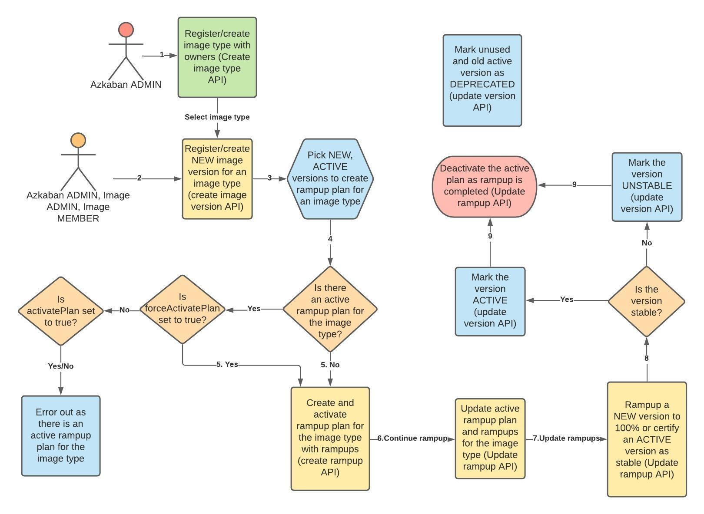

.. _image-mgmt-api:

Image Management API
====================

**Authors**:
`Abhishek Nath <https://github.com/orgs/azkaban/people/abhisheknath2011>`_ ,
`Arvind Pruthi <https://github.com/orgs/azkaban/people/arvindpruthi>`_

**Contributors:**
`Janki Akhani <https://github.com/orgs/azkaban/people/jakhani>`_ ,
`Shardool <https://github.com/orgs/azkaban/people/sshardool>`_ ,
`Deepak Jaiswal <https://github.com/orgs/azkaban/people/djaiswal83>`_ ,
`Aditya Sharma <https://github.com/orgs/azkaban/people/aditya1105>`_

Ref: :ref:`containerization-design.rst`

.. contents:: Table of Contents
  :local:
  :depth: 2

Introduction
------------
In containerized Azkaban, the environment for a Pod that will orchestrate flows will be built dynamically at the time
of launching the flow. Azkaban core, jobtype and platform binaries, each will have their own, independent evolution
cycles with their own, separate docker “images”. Azkaban will have the ability to put together the required binaries
by layering the required images with their desired versions at run-time.

Key Requirements
----------------
1. The image created based on azkaban binaries, platform binaries etc. as part of the release process must be available
   for Azkaban to consume and use.
#. Image owners/developers should be able to roll out their images independently without having dependency on
   Azkaban codebase.
#. Image roll outs to be independent of Azkaban release.
#. Maintain a single source of truth for images and their associated metadata.
#. REST API for image rollouts and rampups to allow for a self-service model.

REST API EndPoints
------------------
Azkaban web server will host these APIs for each Azkaban cluster.

/imageTypes
***********
This end-point is accessible by Azkaban ADMIN only. Creating new imageTypes/jobtypes is one time activity.

.. _create-image-type:

Register new image type (Create)
^^^^^^^^^^^^^^^^^^^^^^^^^^^^^^^^
While registering image type one of the owners must be image type ADMIN (with ADMIN role). At least two owners must
be specified while registering new image types and one of them must be ADMIN. This would help manage the image types
if any one of the owners leaves the organization.

Other two roles are ``MEMBER`` and ``GUEST``. ``ADMIN`` has full access including adding and deleting new owners
(these APIs will be provided later). ``MEMBER`` can perform all the CRUD operations except adding/deleting new
owner (these APIs will be provided later). ``GUEST`` role can have only read/get access to view the image metadata.

- **Method:** POST
- **Request URL:** /imageTypes
- **Request Body:**

+-----------------+-------------+--------------------------------------+
|   Field Name    |     Type    |            Description               |
+=================+=============+======================================+
|  ``imageType``  |   String    |  Image Type Name (PK)                |
+-----------------+-------------+--------------------------------------+
|  ``description``|   String    |  Description of the image type       |
+-----------------+-------------+--------------------------------------+
|  ``deployable`` |   enum      |  IMAGE (docker image), JAR or TAR    |
+-----------------+-------------+--------------------------------------+
|  ``ownerships`` | JSON String | List of:                             |
|                 |             | {"owner": <user-id>, "role": <role>} |
|                 |             |                                      |
|                 |             | Possible roles: ``ADMIN``,           |
|                 |             | ``MEMBER`` or ``GUEST``              |
+-----------------+-------------+--------------------------------------+

**Response:**

.. code-block::

  Status: 201 Created
  Header -> Location: /imageTypes/{id}

/imageVersions
**************
This endpoint is used to register or list image versions for a given image type. The API
assumes that image type is already registered (Create API for /imageTypes was called before) with Azkaban.

The image binary must already be uploaded to a location in artifactory, accessible to Azkaban. Azkaban
does not explicitly check if the image is in fact available. It is the image owner's responsibility to
ensure it's availability prior to calling this API. By calling this API, the image
admin is merely informing Azkaban for the availability of a given image version.

.. _create-image-version:

Create (Register) new Image Version
^^^^^^^^^^^^^^^^^^^^^^^^^^^^^^^^^^^
- **Method:** POST
- **Request URL:** /imageVersions
- **Request Body:**

+-----------------+-------------+-------------------------------------------------+
|   Field Name    |     Type    |            Description                          |
+=================+=============+=================================================+
| ``imagePath``   |   String    | complete path of the image in the artifactory   |
|                 |             | excluding the version string.                   |
+-----------------+-------------+-------------------------------------------------+
| ``imageVersion``|   String    | version string of the format: <major>.<minor>.  |
|                 |             | <patch>                                         |
+-----------------+-------------+-------------------------------------------------+
| ``description`` |   String    |                                                 |
+-----------------+-------------+-------------------------------------------------+
| ``versionState``|   String    | Current state of the image version: ``NEW``,    |
|                 |             | ``ACTIVE``, ``UNSTABLE`` or ``DEPRECATED``.     |
+-----------------+-------------+-------------------------------------------------+
| ``releaseTag``  |   String    | Specific release associated with the version or |
|                 |             | the release which triggered the creation of this|
|                 |             | version                                         |
+-----------------+-------------+-------------------------------------------------+

Following is the description of the versionState fields:

.. _image-version-states:

* **NEW** - All newly registered image versions will be in this state and are yet to be ramped up.
* **ACTIVE** - Post ramp-up, if the image owner finds this version stable, the `update API <#update-image-version>`_
  should be used to update the versionState as ACTIVE.
* **UNSTABLE** - During the process of ramp-up or otherwise, the image owner can mark the image type as ``UNSTABLE``
  to let Azkaban know the state of the image.
* **DEPRECATED** - Any version which is unused or no longer required can be marked as ``DEPRECATED`` using
  the `update API <#update-image-version>`_.

**Response:**

.. code-block::

     Status: 201 Created
     Header -> Location: /imageVersions/{id}

**Example payload for create version request:**

.. code-block:: json

  {
    "imagePath": "container-image-registry.mycorp.com/azkaban/jobtypes/spark-jobtype-image",
    "imageVersion": "1.6.1",
    "imageType": "spark",
    "description": "spark new version",
    "versionState": "NEW",
    "releaseTag": "1.5.9"
  }

.. _get-image-version:

Get Image Version Metadata
^^^^^^^^^^^^^^^^^^^^^^^^^^
This API gets the image metadata for an image type. This is typically a search API. In addition to mandatory
parameter ``imageType``, the API takes two optional parameters: ``imageVersion`` and ``versionState``. Based
on these parameters we should be able to perform search on top of all the available/registered image versions
for an image type. To get the metadata for a specific image version, the Optional parameter: **imageVersion**
should be populated in the request structure. Similarly, to filter the versions based on state, the caller
should populate the optional parameter: **versionState**.

- **Method:** GET
- **Request URL:** /imageVersions?imageType=<image_type>
- **Request Parameters:**

+-----------------+-------------+-------------------------------------------------+
|   Field Name    |     Type    |            Description                          |
+=================+=============+=================================================+
| ``imageType``   | ``String``  | A registered imageType with Azkaban             |
+-----------------+-------------+-------------------------------------------------+
| ``imageVersion``| ``String``  | OPTIONAL Parameter.                             |
+-----------------+-------------+-------------------------------------------------+
| ``versionState``| ``String``  | OPTIONAL Parameter.                             |
+-----------------+-------------+-------------------------------------------------+

**Example:**

.. code-block::

     GET /imageVersions?imageType=spark_job&imageVersion=1.1.0

**Response:**

.. code-block::

     Status: 200 OK
     Returns the matching records
     Format: json

**Example payload for Response:**

.. code-block:: json

  {
    "id": 13,
    "createdBy": "jakhani",
    "createdOn": "2021-01-26 15:28:46.0",
    "modifiedBy": "jakhani",
    "modifiedOn": "2021-01-26 15:31:24.0",
    "description": "Update to active version",
    "releaseTag": "azkaban-docker_0.0.19",
    "imageType": "azkaban-base",
    "imagePath": "container-image-registry.mycorp.com/azkaban-docker/azkaban-base-image",
    "imageVersion": "0.0.19",
    "versionState": "ACTIVE"
  }

.. _update-image-version:

Update Image Version Metadata
^^^^^^^^^^^^^^^^^^^^^^^^^^^^^
Update image version metadata such as state, path and description. Possible values for ``state`` are:
``NEW``, ``ACTIVE``, ``UNSTABLE`` or ``DEPRECATED``. The state will be updated during the process of ramp up.

- **Method:** PATCH
- **Request URL:** /imageVersions/{versionId}
- **Request Body:**

+------------------+-------------+-----------------------------------------------------+
|    Field Name    |     Type    |            Description                              |
+==================+=============+=====================================================+
| ``versionState`` | ``String``  | (REQUIRED) ``NEW``, ``ACTIVE``, ``UNSTABLE`` or     |
|                  |             | ``DEPRECATED``                                      |
+------------------+-------------+-----------------------------------------------------+
| ``imageType``    | ``String``  | (REQUIRED) To validate if the versionId indeed      |
|                  |             | corresponds to the registered imageType.            |
+------------------+-------------+-----------------------------------------------------+
| ``imagePath``    |   String    | (OPTIONAL) Complete path of the image in the        |
|                  |             | artifactory excluding the version string.           |
+------------------+-------------+-----------------------------------------------------+
| ``imageVersion`` |   String    | (OPTIONAL) Version string of the format: <major>.   |
|                  |             | <minor>.<patch>                                     |
+------------------+-------------+-----------------------------------------------------+
| ``description``  |   String    | (OPTIONAL) Updated description string               |
+------------------+-------------+-----------------------------------------------------+

.. _delete-image-version:

Delete Image Metadata
^^^^^^^^^^^^^^^^^^^^^
Delete the image metadata for the given image version id. This API can be used to clean up stale metadata records.

- **Method:** DELETE
- **Request URL:** /imageVersions/{versionId}

/imageRampup
************

.. _create-rampup-plan:

Create new Ramp-Up Plan
^^^^^^^^^^^^^^^^^^^^^^^
- **Method:** POST
- **Request URL:** /imageRampup
- **Request Body:**

+----------------------+-------------+---------------------------------------------------------+
|   Field Name         |     Type    |            Description                                  |
+======================+=============+=========================================================+
| ``planName``         | ``String``  | User provided name                                      |
+----------------------+-------------+---------------------------------------------------------+
| ``imageType``        | ``String``  | Image type                                              |
+----------------------+-------------+---------------------------------------------------------+
| ``description``      | ``String``  | Description                                             |
+----------------------+-------------+---------------------------------------------------------+
| ``activatePlan``     | ``boolean`` | If ``True``, will activate this plan if no existing     |
|                      |             | active plan exists. Otherwise the API will error out.   |
+----------------------+-------------+---------------------------------------------------------+
| ``forceActivatePlan``| ``boolean`` | If ``True``, will mark this plan as Active and          |
|                      |             | mark any existing active plan as: inactive.             |
+----------------------+-------------+---------------------------------------------------------+
| ``imageRampups``     |  ``List``   | List of `ramp-up definitions <#rampup-definition>`_ as  |
|                      |             | shown below. Percentages must add up to 100.            |
+----------------------+-------------+---------------------------------------------------------+

**Ramp-up Definition json block:**

.. _rampup-definition:

.. code-block::

   {
      "imageVersion": <major>.<minor>.<patch>,
      "rampupPercentage": int, // 0-100
      "stabilityTag": enum  // Possible values: EXPERIMENTAL, STABLE or UNSTABLE
   }

Refer to `usage of this API <#use-case-image-rampup>`_ for implementing a Canary.

**Example payload for create Image Ramp-up:**
After the following API is called successfully, Azkaban will pick imageVersion: ``3.1.4``, 70% of the times,
``3.1.2``, 20% of the times and ``3.1.1``, 10% of the times.

.. code-block:: json

  {
    "planName": "Rampup plan for spark job",
    "imageType": "spark",
    "description": "Ramp up for spark job",
    "activatePlan": true,
    "imageRampups":[{"imageVersion": "3.1.4", "rampupPercentage": "70", "stabilityTag": "EXPERIMENTAL"},
                    {"imageVersion": "3.1.2", "rampupPercentage": "20", "stabilityTag": "EXPERIMENTAL"},
                    {"imageVersion": "3.1.1", "rampupPercentage": "10", "stabilityTag": "EXPERIMENTAL"}]
  }

.. _get-rampup-plan:

Get an existing Image Rampup Plan
^^^^^^^^^^^^^^^^^^^^^^^^^^^^^^^^^
Returns an active ramp-up plan for the specified image type if there is one.

- **Method:** GET
- **Request URL:** /imageRampup
- **Request Parameters:**

+-----------------+-------------+---------------------------------------------------------+
|   Field Name    |     Type    |            Description                                  |
+=================+=============+=========================================================+
| ``imageType``   | ``String``  | Image type                                              |
+-----------------+-------------+---------------------------------------------------------+

**Example:**

.. code-block::

     GET /imageRampup?imageType=spark

.. _update-rampup-plan:

Update an existing Image Rampup Plan
^^^^^^^^^^^^^^^^^^^^^^^^^^^^^^^^^^^^
Update the active ramp-up plan and rampup details for an image type.

Only 1 active ramp-up plan is allowed per imageType at any given time. Hence, if the API request
has ``activatePlan`` set to false, the plan will be deactivated. If true, the plan is left active.
Similarly, if ``forceActivatePlan`` is set to false, the plan will be deactivated.

- **Method:** PATCH
- **Request URL:** /imageRampup/{imageType}
- **Request Body:**

+----------------------+-------------+---------------------------------------------------------+
|   Field Name         |     Type    |            Description                                  |
+======================+=============+=========================================================+
| ``activatePlan``     | ``boolean`` | If ``True``, will activate this plan if no existing     |
|                      |             | active plan exists. Otherwise the API will error out.   |
+----------------------+-------------+---------------------------------------------------------+
| ``forceActivatePlan``| ``boolean`` | If ``True``, will mark this plan as Active and          |
|                      |             | mark any existing active plan as: inactive.             |
+----------------------+-------------+---------------------------------------------------------+
| ``imageRampups``     |  ``List``   | List of `rampup definitions <#rampup-definition>`_      |
+----------------------+-------------+---------------------------------------------------------+

**Example payload for Update:**

.. code-block:: json

  {
    "activatePlan": true,
    "imageRampups":[{"imageVersion": "3.1.4", "rampupPercentage": "80", "stabilityTag": "STABLE"},
                    {"imageVersion": "3.1.2", "rampupPercentage": "10", "stabilityTag": "STABLE"},
                    {"imageVersion": "3.1.1", "rampupPercentage": "10", "stabilityTag": "STABLE"}]
  }

Use-Cases and Workflows
-----------------------

New Jobtype/Platform Binary
***************************
When a jobtype/platform developer wants to publish their binary for the 1st time, they need to
register their **imageType** with Azkaban clusters. For this purpose, they can request the Azkaban
ADMIN to call the API to `create image type <#create-image-type>`_ with the required details.

Following this, a `version of the image type must be published <#create-image-version>`_ to be used within Azkaban.
Either Azkaban ADMIN or any image owner with role set to ``ADMIN`` or ``MEMBER`` can call this API.

Image owner wants to publish a new version
******************************************
When a jobtype/platform developer wants to deploy a new version of their binary, they need to invoke the API
to `create new image version <#create-image-version>`_. All imageType users with role as: ``ADMIN`` or ``MEMBER``
as well as Azkaban admin will have privileges to invoke this API.

.. _use-case-image-rampup:

Image owner wants to create a new Ramp-up Plan
**********************************************
When an image owner wants to rampup a new version of their imageType, they can create a new Ramp-up plan for their
imageType. Here is the ramp-up process:

1. Only one ramp up plan can be created and activated at a time. The ramp up plan must have a new version (latest)
   and one or more previous versions. Ramp up percentage for all the versions in a plan must add up to 100.
#. If a new ramp up plan is created for an image type, the previous plan must be deactivated.
#. The image versions used in the ramp-up plan must be already published/registered with Azkaban and the corresponding
   images are expected to be available in Artifactory.
#. The ramp-up plan and ramp ups can be created using the `Create ramp-up plan API <#create-rampup-plan>`_.
#. The caller of the API must be registered with role as: ``ADMIN`` or ``MEMBER`` for the imageType.
#. The ramp-up plan and ramp-up details for an image type can be updated using
   `Update ramp-up API <#update-rampup-plan>`_.
#. In the active ramp up plan, once the new version is successfully ramped up to 100%, the imageType owner must call
   `Update Image Version API <#update-image-version>`_ to mark the fully ramped-up image as: **active**. Also,
   past 100% ramp-up, it is advised for the image owner to de-activate the ramp-up plan using
   `Update ramp-up plan API <#update-rampup-plan>`_.
#. The following flowchart ties in the ramp-up process.

Image owner wants to Ramp-up/Ramp-down an image version
*******************************************************
While ramp-up of an imageType is ongoing, it is expected that the image owner may want to increase/decrease the
percentage of specific image versions. For this purpose, the `Update Ramp-up plan API <#update-rampup-plan>`_
should be used to update the percentages for various versions that the image owner wants Azkaban to use.
The rules defined in `Create Ramp-up plan use case <#use-case-image-rammpup>`_ should still be followed

**Example:** The following API call will change the ramp-up plan so that Azkaban will pick version: ``1.3``, 40%
of the times and ``1.2.1``, 60% of the times.

.. code-block::

  PATCH /image_rampup/SparkJobRampupPlan --body
    {
      "imageRampups": [
              {image_version: "1.2.1", rampup_percentage: 60},
              {image_version: "1.3", rampup_percentage: 40}
      ]
    }

Authentication/Authorization
----------------------------
The existing mechanisms for Authentication/Authorization for Azkaban should extend to these APIs. Please note
that the API for `Create imageType <#create-image-type>`_ establishes the ownership for imageTypes. The
ownerships can be changed by Azkaban admin.

