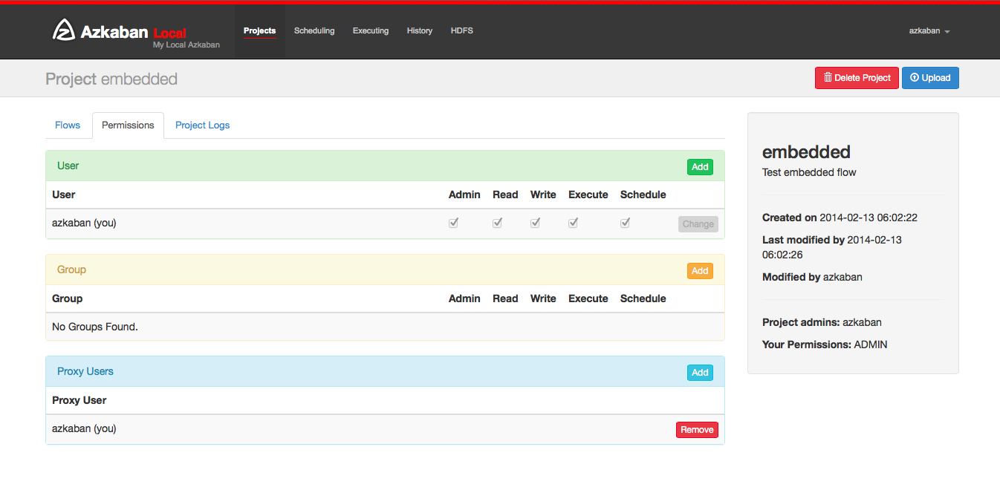
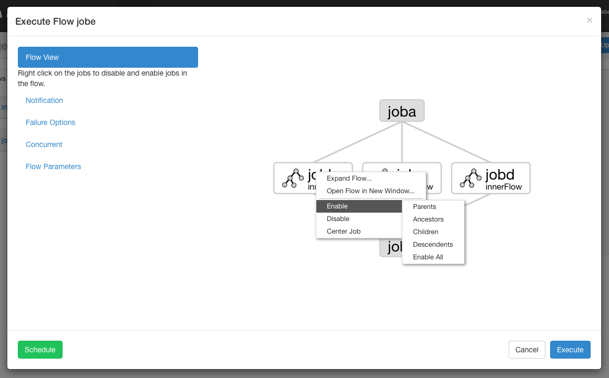
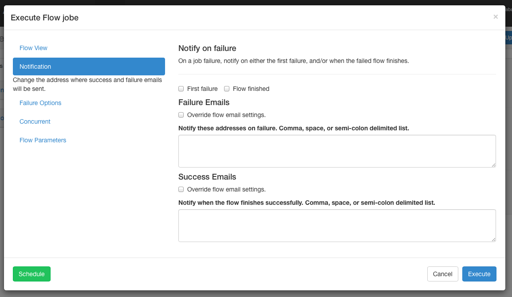
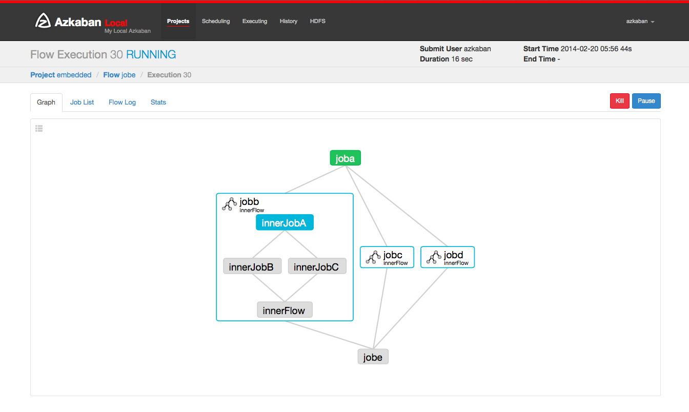
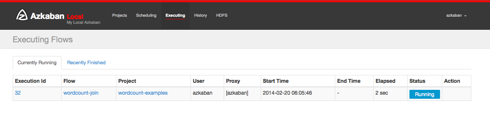
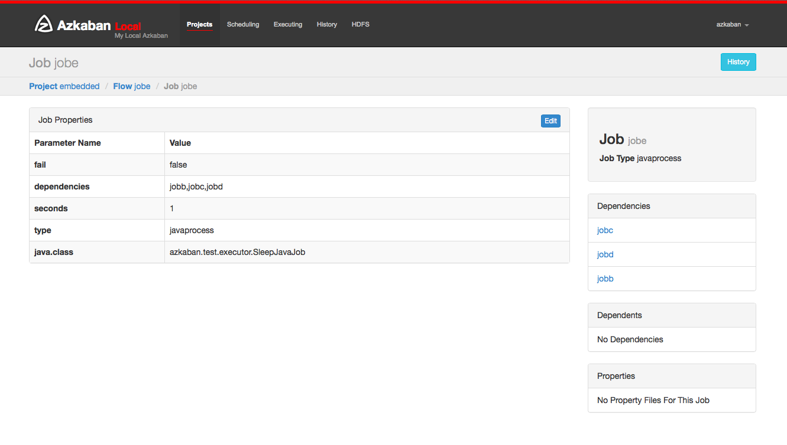
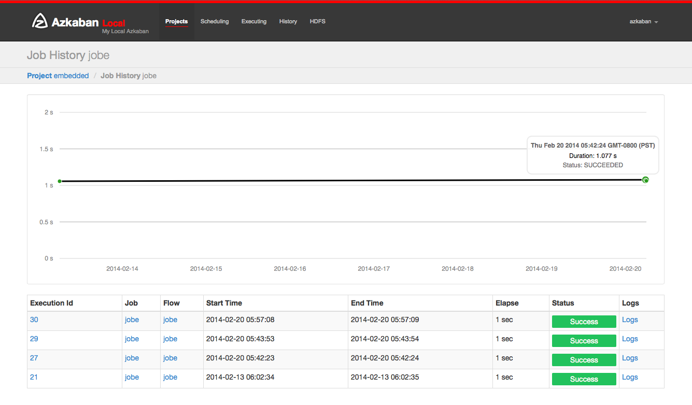

.. _UsingAzkaban:

Using Azkaban
=============

This section covers how to use Azkaban Web UI to create, view and
execution your flows.


Create Projects
---------------

After logging onto Azkaban, you will see the Projects page. This page
will show you a list of all the projects that you have read
permissions on. Projects where only group permissions as or those with
a role with READ or ADMIN will not appear.

.. image:: figures/emptyprojectpage.png

If you are just starting out, the project page may be empty. However
you can see all the existing projects by clicking on All Projects .

Clicking on **Create Projects** will pop open a dialog box. Enter in a
unique project name and description of the project. The description
can be changed in the future, but the project name cannot be. If you
don't see this button, it is likely that the ability to create new
projects has been locked down except for users with the proper
permissions.


After creating your project, an empty project page will appear. You
will automatically be given ADMIN status for this project. Add and
remove permissions by clicking on the Permissions Button.

.. 
  ToDo::"Permissions Button" needs to be linkable to lower section 

.. image:: figures/newprojectpage.png

If you have the proper permissions (which you should if you created
the project), you can delete the project, update the description,
upload files and view the project logs from this page.


Upload Projects
---------------

Click on the **Upload** button. You will see the following dialog.

.. image:: figures/uploadprojects.png

Select the archive file of your workflow files that you want to
upload. Currently Azkaban only supports ``*.zip`` files. The zip should
contain the ``*.job`` files and any files needed to run your jobs. Job
names must be unique in a project.

Azkaban will validate the contents of the zip to make sure that
dependencies are met and that there's no cyclical dependencies
detected. If it finds any invalid flows, the upload will fail.

Uploads overwrite all files in the project. Any changes made to jobs
will be wiped out after a new zip file is uploaded.

After a successful upload, you should see all of your flows listed on
the screen.


Flow View
---------

By clicking on the flow link, you can go to the Flow View page. From
here, you'll be shown a graph representation of the flow. The left
panel contains a list of jobs in your flow.

Right clicking on either the jobs in the right panel or the nodes in
the graph will allow you to open individual jobs. You are also able to
Schedule and Execute Flows from this page.


Click on the Executions tab will show you all the previous executions
of this flow.


Project Permissions
-------------------

When a project is created, the creator is automatically given an ADMIN
status on the project. This allows the creator to view, upload, change
jobs, run flows, delete and add user permissions to the project. An
admin can remove other admins, but cannot remove themselves. This
prevents projects from being admin-less except when admins are deleted
by a user with an admin role.

The permission page is accessible from the project page. On the
permissions page, admins can add other users, groups or proxy users to
the project.



+ Adding user permissions gives those users those specified
  permissions on the project. Remove user permissions by unchecking all
  of the permissions.
+ Group permissions allow everyone in a particular group the specified
  permissions. Remove group permissions by unchecking all the group
  permissions.
+ If proxy users are turned on, proxy users allows the project
  workflows to run as those users. This is useful for locking down which
  headless accounts jobs can proxy to. They are removed by clicking on
  the 'Remove' button once added.


Every user is validated through the UserManager to prevent invalid
users from being added. Groups and Proxy users are also check to make
sure they are valid and to see if the admin is allowed to add them to
the project.

The following permissions can be set for users and groups:


+------------+-------------------------------------------------------------+
| Permission | Description                                                 |
+============+=============================================================+
| ADMIN      | Allows the user to do anything with this project, as well   |
|            | as add permissions and delete the project.                  |
+------------+-------------------------------------------------------------+
| READ       | The user can view the job, the flows, the execution logs.   |
|            |                                                             |
+------------+-------------------------------------------------------------+
| WRITE      | Project files can be uploaded, and the job files can        |
|            | be modified.                                                |
+------------+-------------------------------------------------------------+
| EXECUTE    | The user is allowed to execute, pause, cancel jobs.         |
|            |                                                             |
+------------+-------------------------------------------------------------+
| SCHEDULE   | The user is allowed to add, modify and remove a flow from   |
|            | the schedule.                                               |
+------------+-------------------------------------------------------------+


Executing Flow
--------------
.. 
  ToDo::"Flow View" need to be linkable to lower section 

From the Flow View or the Project Page, you can trigger a job to be
executed. You will see an executing panel pop-up.


Executing Flow View
~~~~~~~~~~~~~~~~~~~
From the Flow View panel, you can right click on the graph and disable
or enable jobs. Disabled jobs will be skipped during execution as if
their dependencies have been met. Disabled jobs will appear
translucent. 




Notification Options
~~~~~~~~~~~~~~~~~~~~

The notification options allow users to change the flow's success or
failure notification behavior.


Notify on Failure
````````````````


+ First Failure - Send failure emails after the first failure is
  detected.
+ Flow Finished - If the flow has a job that has failed, it will send
  failure emails after all jobs in the flow have finished.


Email overrides
````````````````

Azkaban will use the default notification emails set in the final job
in the flow. If overridden, a user can change the email addresses
where failure or success emails are sent. The list can be delimited by
commas, whitespace or a semi-colon.




Failure Options
~~~~~~~~~~~~~~~

When a job in a flow fails, you are able to control how the rest of
the flow will succeed.


+ **Finish Current Running** will finish the jobs that are currently
  running, but it will not start new jobs. The flow will be put in the
  `FAILED FINISHING` state and be set to FAILED once everything
  completes.
+ **Cancel All** will immediately kill all running jobs and set the state
  of the executing flow to FAILED.
+ **Finish All Possible** will keep executing jobs in the flow as long as
  its dependencies are met. The flow will be put in the ``FAILED
  FINISHING`` state and be set to FAILED once everything completes.


Concurrent Options
~~~~~~~~~~~~~~~~~~

If the flow execution is invoked while the flow is concurrently
executing, several options can be set.


+ **Skip Execution** option will not run the flow if its already running.
+ **Run Concurrently** option will run the flow regardless of if its
  running. Executions are given different working directories.
+ **Pipeline** runs the the flow in a manner that the new execution will
  not overrun the concurrent execution.

    + Level 1: blocks executing **job A** until the the previous flow's **job A**
      has completed.
    + Level 2: blocks executing **job A** until the the children of the
      previous flow's **job A** has completed. This is useful if you need to run
      your flows a few steps behind an already executin flow.


Flow Parameters
~~~~~~~~~~~~~~~

Allows users to override flow parameters. The flow parameters override
the global properties for a job, but not the properties of the job
itself.

.. image:: figures/executeflowparameters.png


Executions
----------


Flow Execution Page
~~~~~~~~~~~~~~~~~~~

.. 
  ToDo:: "executing a flow" needs to be linkable to lower section

After executing a flow you will be presented the Executing Flow page.
Alternatively, you can access these flows from the Flow View page
under the Executions tab, the History page, or the Executing page.

This page is similar to the Flow View page, except it shows status of
running jobs.



Selecting the Job List will give a timeline of job executions. You can
access the jobs and job logs directly from this list.

.. image:: figures/executingflowpagejobslist.png

This page will auto update as long as the execution is not finished.

Some options that you are able to do on execution flows include the
following:


+ Cancel - kills all running jobs and fails the flow immediately. The
  flow state will be KILLED.
+ Pause - prevents new jobs from running. Currently running jobs
  proceed as usual.
+ Resume - resume a paused execution.
+ Retry Failed - only available when the flow is in a FAILED FINISHING
  state. Retry will restart all FAILED jobs while the flow is still
  active. Attempts will appear in the Jobs List page.
+ Prepare Execution - only available on a finished flow, regardless of
  success or failures. This will auto disable successfully completed
  jobs.


Executing Page
~~~~~~~~~~~~~~

Clicking on the Executing Tab in the header will show the Execution
page. This page will show currently running executions as well as
recently finished flows.




History Page
~~~~~~~~~~~~

Currently executing flows as well as completed executions will appear
in the History page. Searching options are provided to find the
execution you're looking for. Alternatively, you can view previous
executions for a flow on the Flow View execution tab.

.. image:: figures/historypage.png


Schedule Flow
-------------
..
  ToDo::  "execute flows" needs to be linkable
From the same panel that is used to `execute flow <#executing-flow>`_, flows can be
scheduled by clicking on the *Schedule* button.

.. image:: figures/flexible-scheduling.png

Any flow options set will be preserved for the scheduled flow. For
instance, if jobs are disabled, then the scheduled flow's jobs will
also be disabled.

With new flexible scheduling feature in Azkaban 3.3, User are able to
define a cron job following `Quartz syntax <http://www.quartz-scheduler.org/documentation/quartz-2.x/tutorials/crontrigger.html>`_. One important change
different from Quartz or cron is that Azkaban functions at the minute
granularity at most. Therefore, second field in UI is labeled as a
static "0". The `Flexible Schedule Wiki <https://github.com/azkaban/azkaban/wiki/New-Azkaban-Schedule-Introduction>`_ explains the details how to
use.

After scheduling, it should appear on the schedule page, where you can
remove the scheduled job or set the SLA options.


SLA
~~~

To add SLA notification or pre-emption, click on the SLA button. From
here you can set the SLA alert emails. Rules can be added and applied
to individual jobs or the flow itself. If duration threshold is
exceeded, then an alert email can be set or the flow or job can be
auto killed. If a job is killed due to missing the SLA, it will be
retried based on the retry configuration of that job.


Job Page
--------

Jobs make up individual tasks of a flow. To get to the jobs page, you
can right click on a job in the Flow View, the Executing Flow view or
the Project Page.



From this page you can see the dependencies and dependents for a job
as well as the global properties that the job will use.


Job Edit
~~~~~~~~

Clicking on Job Edit will allow you to edit all the job properties
except for certain reserved parameters, such as ``type``, and
``dependencies``. The changes to the parameters will affect an executing
flow only if the job hasn't started to run yet. These overwrites of
job properties will be overwritten by the next project upload.

.. image:: figures/jobedit.png


Job History
~~~~~~~~~~~


Any retries of a job will show as ``executionid.attempt`` number.




Job Details
-----------

From an execution page, after clicking "Job List" and then "Details"
for one of the jobs, you will arrive at the job details page. This
page contains tabs for the "Job Logs" and a "Summary".


Job Logs
~~~~~~~~

The job logs are stored in the database. They contain all the stdout
and stderr output of the job.

.. image:: figures/joblogs.png


Job Summary
~~~~~~~~~~~
The Job Summary tab contains a summary of the information in the job
logs. This includes:

+ **Job Type** - the jobtype of the job
+ **Command Summary** - the command that launched the job process, with
  fields such as the classpath and memory settings shown separately as
  well
+ **Pig/Hive Job Summary** - custom stats specific to Pig and Hive jobs
+ **Map Reduce Jobs** - a list of job ids of Map-Reduce jobs that were
  launched, linked to their job tracker pages

.. image:: figures/jobsummary.png
