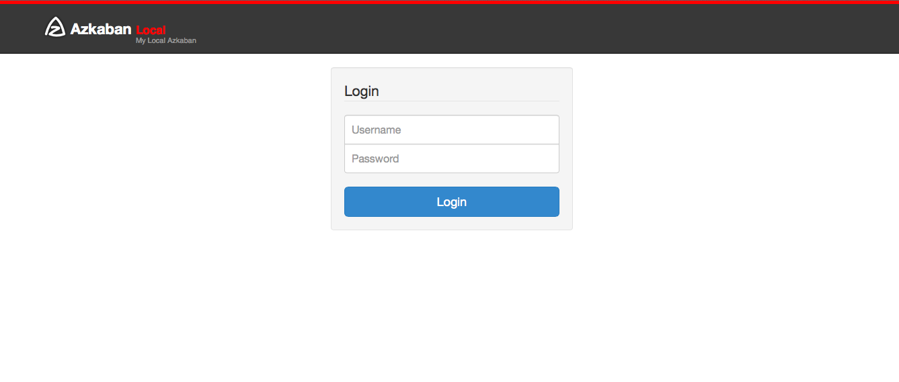

.. _configs:

UserManager
==================================

When you start Azkaban, you may notice the login page. Azkaban makes you authenticate before you can use it.
This is prevent seeing or executing workflows you shoudn’t see or touch.

We also used authenticated users for auditing purposes. Whenever project files change, is modified, scheduled, etc.
we often want to know which user performed that action.

**user login in page:**

*****
XmlUserManager
*****

The XmlUserManager is the default UserManager that is built into
Azkaban. To explicitly set the parameters that configure the
XmlUserManager, the following parameters can be set in the
``azkaban.properties`` file.

+-----------------------+-----------------------------+
| Parameter             | Default                     |
+=======================+=============================+
| user.manager.class    | azkaban.user.XmlUserManager |
+-----------------------+-----------------------------+
| user.manager.xml.file | azkaban-users.xml           |
+-----------------------+-----------------------------+

The other file that needs to be modified is the ``azkaban-users.xml``
file. The XmlUserManager will parse the user xml file once during
startup to set up the users.

Everything must be enclosed in a ``<azkaban-users>`` tag. ::

   <azkaban-users>
       ...
   </azkaban-users>

Users
**********************

To add users, add the ``<user>`` tag.::

  <azkaban-users>
     <user username="myusername" password="mypassword" roles="a" groups="mygroup" / >
     <user username="myusername2" password="mypassword2" roles="a, b" groups="ga, gb" / >
     ...
   </azkaban-users>

+-----------------------+-----------------------+-----------------------+
| Attributes            | Values                | Required?             |
+=======================+=======================+=======================+
| username              | The login username.   | yes                   |
+-----------------------+-----------------------+-----------------------+
| password              | The login password.   | yes                   |
+-----------------------+-----------------------+-----------------------+
| roles                 | Comma delimited list  | no                    |
|                       | of roles that this    |                       |
|                       | user has.             |                       |
+-----------------------+-----------------------+-----------------------+
| groups                | Comma delimited list  | no                    |
|                       | of groups that the    |                       |
|                       | users belongs to.     |                       |
+-----------------------+-----------------------+-----------------------+
| proxy                 | Comma delimited list  | no                    |
|                       | of proxy users that   |                       |
|                       | this users can give   |                       |
|                       | to a project          |                       |
+-----------------------+-----------------------+-----------------------+

Groups
**********************

To add users, add the ``<group>`` tag.::

   <azkaban-users>
     <user username="a" ... groups="groupa" / >
     ...
     <group name="groupa" roles="myrole" / >
     ...
   </azkaban-users>

In the previous example, user 'a' is in the group 'groupa'. User 'a'
would also have the 'myrole' role. A regular user cannot add group
permissions to a project unless they are members of that group.

The following are some group attributes that you can assign.

+------------+---------------------------------------------------+-----------+
| Attributes | Values                                            | Required? |
+============+===================================================+===========+
| name       | The group name                                    | yes       |
+------------+---------------------------------------------------+-----------+
| roles      | Comma delimited list of roles that this user has. | no        |
+------------+---------------------------------------------------+-----------+

Roles
**********************
Roles are different in that it assigns global permissions to users in
Azkaban. You can set up roles with the ``<roles>`` tag.::

   <azkaban-users>
     <user username="a" ... groups="groupa" roles="readall" / >
     <user username="b" ... / >
     ...
     <group name="groupa" roles="admin" / >
     ...
     <role name="admin" permissions="ADMIN" / >
     <role name="readall" permissions="READ" / >
   </azkaban-users>

In the above example, user 'a' has the role 'readall', which is defined
as having the READ permission. This means that user 'a' has global READ
access on all the projects and executions.

User 'a' also is in 'groupa', which has the role ADMIN. It's certainly
redundant, but user 'a' is also granted the ADMIN role on all projects.

The following are some group attributes that you can assign.

+-------------+------------------------------------------------------+-----------+
| Attributes  | Values                                               | Required? |
+=============+======================================================+===========+
| name        | The group name                                       | yes       |
+-------------+------------------------------------------------------+-----------+
| permissions | Comma delimited list global permissions for the role | yes       |
+-------------+------------------------------------------------------+-----------+

The possible role permissions are the following:

+-----------------------------------+-----------------------------------+
| Permissions                       | Values                            |
+===================================+===================================+
| ADMIN                             | Grants all access to everything   |
|                                   | in Azkaban.                       |
+-----------------------------------+-----------------------------------+
| READ                              | Gives users read only access to   |
|                                   | every project and their logs      |
+-----------------------------------+-----------------------------------+
| WRITE                             | Allows users to upload files,     |
|                                   | change job properties or remove   |
|                                   | any project                       |
+-----------------------------------+-----------------------------------+
| EXECUTE                           | Allows users to trigger the       |
|                                   | execution of any flow             |
+-----------------------------------+-----------------------------------+
| SCHEDULE                          | Users can add or remove schedules |
|                                   | for any flows                     |
+-----------------------------------+-----------------------------------+
| CREATEPROJECTS                    | Allows users to create new        |
|                                   | projects if project creation is   |
|                                   | locked down                       |
+-----------------------------------+-----------------------------------+

*****
Custom User Manager
*****

Although the XmlUserManager is easy enough to get started with, you may
want to integrate with an already established directory system, such as
LDAP.

It should be fairly straight forward to implement a custom UserManager.
The UserManager is a java interface. There are only a few methods needed
to implement.::

   public interface UserManager {
       public User getUser(String username, String password) throws UserManagerException;
       public boolean validateUser(String username);
       public boolean validateGroup(String group);
       public Role getRole(String roleName);
       public boolean validateProxyUser(String proxyUser, User realUser);
   }

The constructor should take an ``azkaban.utils.Props`` object. The
contents of ``azkaban.properties`` will be available for the UserManager
for configuration.

Package your new custom UserManager into a jar and drop it into the
``./extlib`` directory or alternatively into the plugins directory (i.e.
``./plugins/ldap/linkedin-ldap.jar``).

Change the ``azkaban.properties`` configuration to point to the custom
UserManager. Add additional parameters into ``azkaban.properties`` if
needed by your custom user manager.

+------------------------+------------------------------------+
| Parameter              | Default                            |
+========================+====================================+
| ``user.manager.class`` | ``azkaban.user.CustomUserManager`` |
+------------------------+------------------------------------+
